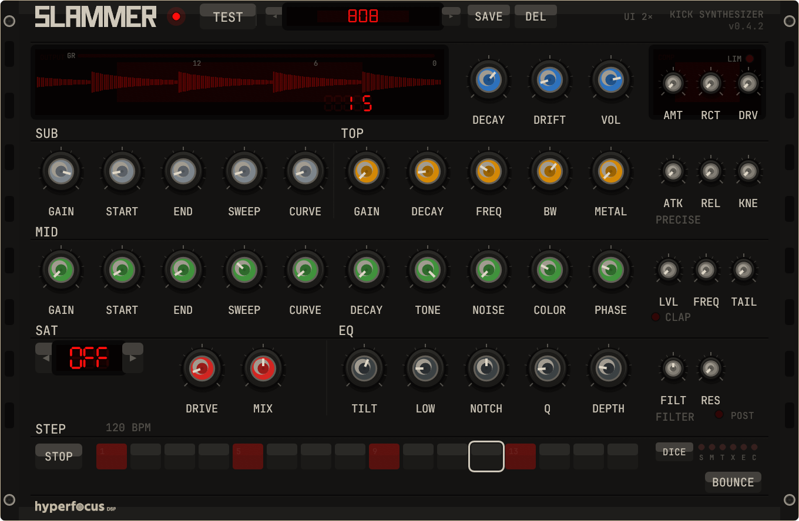

# Slammer

A three-layer synthesized kick drum plugin with a parallel 909-style
clap voice. SUB sine, MID sine+noise, and a band-passed click TOP mix
into a five-voice distortion palette, a tilt/low/notch master EQ, and a
full master bus (RMS compressor → transformer drive → brickwall limiter
→ auto tube warmth). Ships with a 16-step pattern sequencer, a factory
+ user preset browser, one-shot WAV/AIFF bounce, and a fully
interactive standalone editor.



**Formats:** VST3, CLAP, Standalone
**Platforms:** Linux, macOS (Apple Silicon + Intel), Windows
**License:** GPL-3.0-or-later

## Listen

▶ **[Play sound samples in your browser](https://hyperfocusdsp.github.io/slammer/)**

Ten one-shots bounced straight out of the plugin via the BOUNCE button —
clean kicks, 808/909 emulations, claps, snares, toms, and hats. No
download, just hit play.

## Quick start

Download the latest build for your platform from the
[Releases](https://github.com/hyperfocusdsp/slammer/releases/latest) page,
extract, and run the installer:

```bash
# Linux / macOS
./install.sh

# Windows (run as Administrator)
install.bat
```

Rescan plugins in your DAW. Slammer appears as **Hyperfocus DSP / Slammer**.

## Download

| Platform                  | File                               |
|---------------------------|------------------------------------|
| Linux x86_64              | `slammer-linux-x86_64.tar.gz`      |
| macOS ARM (Apple Silicon) | `slammer-macos-arm64.tar.gz`       |
| macOS Intel               | `slammer-macos-x86_64.tar.gz`      |
| Windows x86_64            | `slammer-windows-x86_64.zip`       |

Each archive contains the standalone binary, VST3 and CLAP plugin
bundles, and an install script.

### Verify your download

Every release ships a `SHA256SUMS.txt` file on the
[Releases](https://github.com/hyperfocusdsp/slammer/releases/latest) page.
Download it alongside the archive and verify before running:

```bash
# Linux / macOS
sha256sum -c SHA256SUMS.txt

# Windows (PowerShell)
Get-Content SHA256SUMS.txt | ForEach-Object {
  $hash, $file = $_ -split '\s+'
  $actual = (Get-FileHash $file -Algorithm SHA256).Hash.ToLower()
  if ($actual -eq $hash) { "$file OK" } else { "$file FAILED" }
}
```

You can also upload the archive to [VirusTotal](https://www.virustotal.com/gui/home/upload)
for a third-party scan before running — slammer is unsigned open-source
software, so extra caution is welcome.

## macOS setup — step by step

The binaries are **not codesigned or notarized**, so macOS will block
them on first launch. Here's the complete boomer-friendly walkthrough:

### 1. Extract the archive

Double-click the `.tar.gz` file in Finder — macOS extracts it
automatically into a folder next to the archive. Or, if you prefer
Terminal:

```bash
cd ~/Downloads
tar xzf slammer-macos-arm64.tar.gz
cd slammer-macos-arm64
```

### 2. Remove the quarantine flag

macOS marks every downloaded file as untrusted. You need to clear that
flag on everything inside the extracted folder. Open Terminal, `cd` into
the folder, and run:

```bash
xattr -dr com.apple.quarantine .
```

(The dot at the end is important — it means "this folder and
everything in it".)

### 3. Run the standalone

Use the included launch script — it configures the audio buffer size so
CoreAudio plays nicely with nih-plug's backend:

```bash
./slammer-macos.sh
```

If macOS still blocks the binary after you've removed the quarantine
flag, open **System Settings → Privacy & Security**, scroll to the
bottom, and click **Open Anyway** next to the Slammer warning. You
only need to do this once; future launches will go straight through.

### 4. Install the plugins for your DAW

Copy the VST3 and CLAP bundles into the standard macOS plugin
locations:

```bash
cp -r slammer.vst3 ~/Library/Audio/Plug-Ins/VST3/
cp -r slammer.clap ~/Library/Audio/Plug-Ins/CLAP/
```

Then rescan plugins in your DAW.

**Note on the launch script:** `slammer-macos.sh` starts the standalone
with `--period-size 4096` to work around a CoreAudio variable-buffer
issue in nih-plug's CPAL backend
([upstream bug](https://github.com/robbert-vdh/nih-plug/issues/266)).
This adds slight latency in standalone mode only. VST3 and CLAP running
inside a DAW are unaffected.

**Audio Unit (AU) is not supported.** Most macOS DAWs (Ableton Live,
Bitwig, REAPER, Renoise, FL Studio) support VST3 or CLAP. Logic Pro is
AU-only and will not see Slammer.

## Features

### Signal chain

```
SUB + MID + TOP voices  (+ parallel CLAP voice)
  → per-voice saturation (5-mode palette)
  → master EQ (tilt / low shelf / notch)
  → master bus (RMS comp → transformer drive → brickwall limiter)
  → auto tube warmth (engages above 0 dB master)
  → master volume → out
```

### DSP

- **Three-layer kick engine** — SUB sine with pitch envelope, MID
  sine+noise blend, TOP bandpass-filtered click transient. Each layer
  has independent tuning, amp + pitch envelopes, and drift.
- **909-style CLAP layer** — parallel voice, white noise → 2-pole SVF
  bandpass → baked 3-burst + exponential tail envelope. Tunable
  independently of the kick (level, center frequency 500–5000 Hz, tail
  50–400 ms). Toggleable; bit-identical bypass when off.
- **Five-voice distortion palette** — each mode is a genuinely
  different curve, not just gain+tanh:
  - *Sat Clip* — split-band rational hard-shoulder (`x/√(1+x²)`) with
    a 60 Hz low-pass bypass that keeps the sub clean.
  - *Sat Diode* — asymmetric exponential pair.
  - *Sat Tape* — drive-reactive low-pass plus hysteresis memory; the
    only mode with dynamic/frequency-dependent behavior.
  - *Transformer drive* (master bus) — polynomial 2nd+3rd harmonic
    blend with a feed-forward 60 Hz "bloom" filter.
  - *Master warmth* — asymmetric cubic bias shaper that auto-engages
    above 0 dB master volume; bit-exact bypass below unity.
- **Master bus compressor** — three macros (Amount, Reaction,
  Transformer drive) for fast moves, plus a precision strip with
  independent Attack (0.3–50 ms), Release (20–800 ms), and soft Knee
  (0–12 dB, Reiss & McPherson quadratic). Brickwall limiter LED, GR
  meter. RCT acts as a link macro — moving it writes Attack and
  Release together via the host parameter API. Knee = 0 is
  bit-identical to a hard-knee path.
- **Master EQ** — tilt, low shelf, and variable-Q notch.
- **One-shot bounce** — render the current sound with the full chain
  to a 16-bit / 44.1 kHz WAV or AIFF via a dedicated BOUNCE button.
  Runs offline on the GUI thread against a fresh DSP instance, so live
  audio keeps flowing during the render and the result is bit-for-bit
  reproducible.

### UI

- **Single-window editor** — 680 × 444 rack panel with aspect-ratio
  locked scaling; resize the DAW window and the UI scales without
  distortion.
- **Header preset bar** — 7-segment LED display, dropdown browser,
  inline rename (double-click to edit), save, delete. Up/Down arrow
  keys cycle presets. Factory presets are protected from deletion.
- **16-step pattern sequencer** — four-on-the-floor default, click or
  drag to paint steps. Runs standalone with internal transport, or
  locks to host tempo and transport inside a DAW.
- **Interactive tempo entry** (standalone only) — single-click the BPM
  readout to arm, drag vertically to scrub, double-click to type a
  value, or use Left/Right arrows (±10, Shift for ±1). Host-synced
  mode keeps the readout read-only.
- **Waveform scope** — live output waveform display fed post-comp, so
  the trace visibly shrinks under compression and caps under the
  limiter. GR meter sits next to it.
- **Test trigger** — press `T` anywhere in the editor to fire a kick
  without MIDI.
- **BOUNCE button** — one click renders a single hit, opens a native
  save dialog (remembered between bounces), writes WAV or AIFF.

### Persistence

- **Factory + user presets** — stored as forward-compatible JSON with
  `#[serde(default)]` on every field, so new parameters in later
  versions won't break existing files.
- **Last preset recall** (standalone) — the editor remembers the last
  loaded preset and restores it on next launch.
- **DAW state** — full parameter + sequencer pattern persistence
  inside DAW project files.

## Controls

| Input                     | Action                                    |
|---------------------------|-------------------------------------------|
| `T` key                   | Fire a test kick                          |
| MIDI NoteOn               | Trigger the engine (velocity → VEL knob)  |
| BOUNCE button             | Render current sound to WAV / AIFF        |
| Click + vertical drag     | Adjust any knob                           |
| Shift + drag              | Fine control                              |
| Ctrl + click (knob)       | Reset knob to default                     |
| Double-click (knob)       | Reset to default                          |
| Arrow Up / Down           | Cycle presets (prev / next)               |
| Arrow Left / Right        | Tempo ±10 BPM (when tempo armed)          |
| Shift + Left / Right      | Tempo ±1 BPM (when tempo armed)           |
| Space                     | Play / stop sequencer (standalone only)   |
| Click on BPM readout      | Arm tempo widget                          |
| Double-click BPM readout  | Enter tempo value by keyboard             |

## Preset and log locations

Resolved via the `directories` crate — correct on every platform:

| Platform | Presets                                         | Logs                                       |
|----------|-------------------------------------------------|--------------------------------------------|
| Linux    | `~/.local/share/slammer/presets/`               | `~/.local/share/slammer/slammer.log`       |
| macOS    | `~/Library/Application Support/Slammer/presets/`| `~/Library/Application Support/Slammer/slammer.log` |
| Windows  | `%APPDATA%\Slammer\slammer\data\presets\`       | `%APPDATA%\Slammer\slammer\data\slammer.log` |

## Building from source

### Prerequisites

**Rust** (stable, 1.75+):

```bash
curl --proto '=https' --tlsv1.2 -sSf https://sh.rustup.rs | sh
```

**System dependencies** (Linux only — macOS and Windows need nothing
extra beyond Rust):

<details>
<summary>Debian / Ubuntu / Pop!_OS</summary>

```bash
sudo apt update
sudo apt install build-essential pkg-config cmake \
    libx11-dev libx11-xcb-dev libxcb1-dev libxcb-icccm4-dev libxcb-keysyms1-dev \
    libxcursor-dev libxkbcommon-dev libgl-dev libasound2-dev libjack-dev
```
</details>

<details>
<summary>Arch Linux / Manjaro</summary>

```bash
sudo pacman -S --needed base-devel pkg-config cmake \
    libx11 libxcb xcb-util xcb-util-wm xcb-util-keysyms \
    libxcursor libxkbcommon mesa alsa-lib jack2
```
</details>

### Build

```bash
git clone https://github.com/hyperfocusdsp/slammer.git
cd slammer

# Standalone only (quick dev loop)
cargo run --release --bin slammer-standalone

# Full plugin bundles → target/bundled/slammer.{vst3,clap}
cargo xtask bundle slammer --release
```

The project is pinned to a specific `nih-plug` commit for reproducible
builds — see `Cargo.toml` for the current SHA.

### Development

```bash
cargo test                                  # DSP unit tests
cargo clippy --all-targets -- -D warnings   # lint gate used by CI
cargo fmt                                   # rustfmt
```

## Project layout

```
src/
├── lib.rs              crate root + nih_plug exports
├── main.rs             thin standalone wrapper
├── plugin.rs           Plugin impl: process(), editor(), MIDI
├── params.rs           SlammerParams + ParamSnapshot (preset round-trip)
├── presets.rs          factory presets + user preset I/O
├── sequencer.rs        16-step atomic sequencer (audio↔GUI via atomics)
├── logging.rs          tracing subscriber + log rotation
│
├── dsp/
│   ├── engine.rs       KickEngine: three-layer mix, master EQ
│   ├── oscillator.rs   band-limited sine
│   ├── envelope.rs     pitch + amp envelopes
│   ├── noise.rs        colored noise generator
│   ├── click.rs        pre-rendered bandpass click buffer
│   ├── clap.rs         909-style parallel clap voice (bandpass + 3-burst env)
│   ├── drift.rs        per-trigger analog-style pitch jitter
│   ├── filter.rs       biquad + master EQ chain
│   ├── saturation.rs   five-voice distortion palette (pre-EQ)
│   ├── master_bus.rs   RMS comp (macro + precise) + transformer drive + limiter
│   └── tube.rs         auto master warmth (post-bus, pre master-vol)
│
├── export/
│   ├── mod.rs          BOUNCE entry point + remembered-path config
│   ├── render.rs       offline one-shot render mirroring the live chain
│   └── writer.rs       16-bit WAV (hound) + AIFF writers
│
├── ui/
│   ├── editor.rs       top-level egui shell
│   ├── panels.rs       layout: header, master row, layer rows, sequencer
│   ├── preset_bar.rs   preset LED display + dropdown + save/delete
│   ├── seven_seg.rs    7-segment LED rendering
│   ├── knob.rs         industrial knob widget
│   ├── widgets.rs      shared drawing primitives (groove, LED, rack ear)
│   └── theme.rs        colors, fonts, spacing
│
└── util/
    ├── paths.rs        cross-platform data/preset/log directories
    ├── telemetry.rs    lock-free audio→UI peak ring buffer
    └── messages.rs     lock-free UI→audio command queue
```

## Known limitations

- **No Audio Unit (AU) support** — nih-plug limitation; use VST3 or CLAP.
- **Window scaling** — aspect ratio is locked, but the window is not
  free-form resizable (egui-baseview limitation). Host window size
  snaps to the nearest integer multiple of the 680×444 base layout.
- **Standalone on macOS Apple Silicon** — requires the included
  `slammer-macos.sh` launch script to set `--period-size 4096`. VST3
  and CLAP inside a DAW are unaffected.
- **Standalone on Windows** — the binary probes the default WASAPI
  output device at launch and uses its mix-format sample rate plus a
  2048-sample period, because nih-plug's defaults (48 kHz / 512)
  mismatch many Windows configurations. Pass `--sample-rate` /
  `--period-size` explicitly to override.

## Dependencies

Built with [nih-plug](https://github.com/robbert-vdh/nih-plug) (plugin
framework), [egui](https://github.com/emilk/egui) (GUI),
[parking_lot](https://crates.io/crates/parking_lot) (locks),
[rtrb](https://crates.io/crates/rtrb) (lock-free ring buffer), and
[directories](https://crates.io/crates/directories) (cross-platform
paths). See `Cargo.toml` for the full list.

## License

GPL-3.0-or-later. See [`LICENSE`](LICENSE) for the full text.
